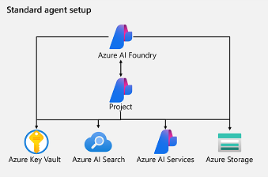
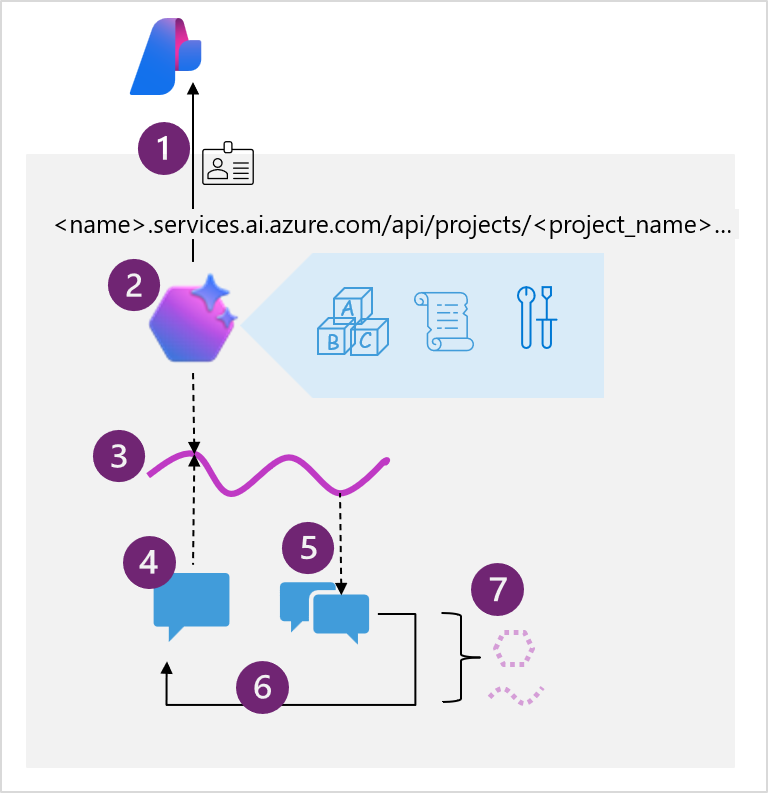

# What is an AI Agent?
    AI agents are smart software services that combine generative AI models with contextual data and the ability to automate tasks based on user input and environmental factors that they perceive.

# Components of an agent
## Model
## Knowledge
## Tools

# List of Agent Development Framework
## Azure AI Foundry Agent Service
    * Azure define framework to create & manage AI Agents
    * Use [Azure AI Foundry resource](https://learn.microsoft.com/en-us/azure/ai-services/agents/)

    

### [Tools available for Agent](https://learn.microsoft.com/en-us/training/modules/develop-ai-agent-azure/4-when-use-agent-service)
    * Tools make additional functionality available to your agent
    * assign tools when creating an agent in the Azure AI Foundry portal
    * or when defining an agent in code using the SDK.
#### Knowledge tools
    * Bing Search: Uses Bing search results to ground prompts with real-time live data from the web.
    * File search: Grounds prompts with data from files in a vector store.
    * Azure AI Search: Grounds prompts with data from Azure AI Search query results.
    * Microsoft Fabric: Uses the Fabric Data Agent to ground prompts with data from your Fabric data stores.
#### Action Tools
    * Code Interpreter: Generate Python code that can access and process uploaded files. (in other words, Agent will answer questions based on the contents of this document)
    * Custom function: Call your custom function code – you must provide function definitions and implementations.
    * Azure Function: Call code in serverless Azure Functions.
    * OpenAPI Spec: Call external APIs based on the OpenAPI 3.0 spec.
## [OpenAI Assistants API](https://learn.microsoft.com/en-us/azure/ai-services/openai/how-to/assistant)
    * Use Foundry Agent Service but allowed on OpenAI models
    * greater flexibility and functionality
## Semantic Kernel
    *  Open-source and multi-agent supported framework
    * [Semantic Kernel Agent Framework](https://learn.microsoft.com/en-us/semantic-kernel/frameworks/agent/?pivots=programming-language-csharp)
## AutoGen
    * Can build Agent without writting codes
    * [AutoGen framework](https://microsoft.github.io/autogen/stable/index.html)
## [Microsoft 365 Agents SDK](https://learn.microsoft.com/en-us/microsoft-365/agents-sdk/)
    * to dliver Agents in Microsoft 365 applications
    * also can deliver in Slack & Messenger apps.
## [Microsoft Copilot Studio](https://learn.microsoft.com/en-us/microsoft-copilot-studio/)
    * Visual design interface of Copilot Studio for building agents

#  Agent Project Idea for Gaming
Simulated (NPC) Opponents:
    * Most AI opponents follow hardcoded behavior trees
    * Sim Agent analyze the player’s strategies and counter with enemies(NPC) in real time.
Storytelling Agent:
    * Most games use pre-written dialogues
    * Conversational story teller agent could have dynamic conversations with memory of player choices.

Game Master Agent:
    * Most survival games rely on predefined gaming story.
    * Game Master analyze player tactics and dynamically send aggressive enemies, limit resources, create random events.

AI Agents as “Living” Opponents & Allies (Beyond Standard NPC AI)
    * AI agents could use reinforcement learning (RL) to evolve.
    * Enemies and allies in your game LEARN over time, creating a more immersive experience.

#  Ecample Agentic App

    * 1- Connect to the AI Foundry project for your agent, using the project endpoint and Entra ID authentication.
    * 2- Get a reference to an existing agent
        * The model deployment that the agent interpret and respond to prompts.
        * Instructions that determine the functionality and behavior.
        * Tools and resources that the agent can use to perform tasks.
    * 3- Create a stateful thread that retains message history and data artifacts generated during the chat.
    * 4- Add messages to the thread and invoke it with the agent.
    * 5- Check the thread status, and when ready, retrieve the messages and data artifacts.
    * 6- Repeat the previous two steps as a chat loop until the conversation can be concluded.
    * 7- When finished, delete the agent and the thread to clean up.

