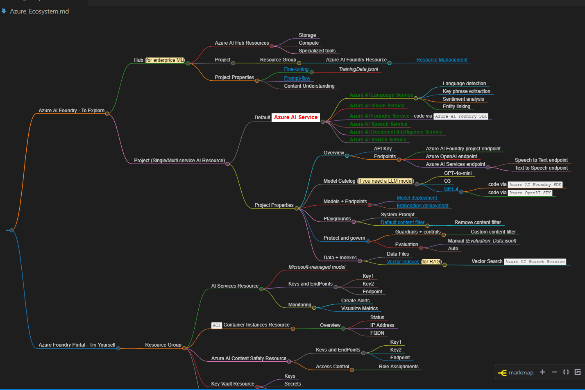

# AI-102 Project

## Overview
This project contains my own shortnotes, created for Microsfot AI Enginner Associate Certification - AI-102.





## Setup Instructions

### 1. Create the Conda Environment
Create an `env.yml` file with the following content:

```yaml
name: ai-102
dependencies:
  - python=3.9
  - pip
  - nodejs
  - pip:
      - markmap-cli
```

To install conda:
  - wget https://repo.anaconda.com/miniconda/Miniconda3-latest-Linux-x86_64.sh
  - bash Miniconda3-latest-Linux-x86_64.sh
  - add path to bashrc. eg: PATH=$PATH:$HOME/.local/bin:$HOME/bin:~/miniconda3/bin
  - conda --version
  
Then, create the environment:
```bash
conda env create -f env.yml
conda init --all --verbose

conda activate ai-102
```

update existing env
```bash
conda env update --name ai-102 --file env.yml --prune
```

to remove env
```bash
conda env remove --name ai-102
```


### 2. Install npm Dependencies
If your project uses npm packages, run:
```bash
npm install
```

### 3. Install markmap-cli (if not installed via pip)
```bash
npm install -g markmap-cli
```
  VS Code Graph visualize - Markdown preview Mermaid Support
## Usage
- To recognize text in images, follow the instructions in `ai-102.md` (to be created).
- To visualize markdown as a mindmap:
```bash
markmap ai-102.md
```

## Features
- Text recognition in images
- Markdown mindmap visualization


## Contributing
Pull requests are welcome. For major changes, please open an issue first to discuss what you would like to change.

## License
[MIT](LICENSE)

