# What is an AI Agent?
    AI agents are smart software services that combine generative AI models with contextual data and the ability to automate tasks based on user input and environmental factors that they perceive.

# Components of an agent
## Model
## Knowledge
## Tools

# List of Agent Development Framework
## Azure AI Foundry Agent Service
   * Azure define framework to create & manage AI Agents
   * Use [Azure AI Foundry resource](https://learn.microsoft.com/en-us/azure/ai-services/agents/)

    

### [Tools available for Agent](https://learn.microsoft.com/en-us/training/modules/develop-ai-agent-azure/4-when-use-agent-service)
   Tools make additional functionality available to your agent
   Assign tools when creating an agent in the Azure AI Foundry portal or when defining an agent in code using the SDK.
#### [1] Knowledge tools [Built-in]
   * Bing Search: Uses Bing search results to ground prompts with real-time live data from the web.
   * File search: Grounds prompts with data from files in a vector store.
   * Azure AI Search: Grounds prompts with data from Azure AI Search query results.
   * Microsoft Fabric: Uses the Fabric Data Agent to ground prompts with data from your Fabric data stores.
#### [2] Action Tools [Built-in](https://learn.microsoft.com/en-us/training/modules/build-agent-with-custom-tools/1-introduction)
   * Code Interpreter: Generate Python code that can access and process uploaded files. (in other words, Agent will answer questions based on the contents of this document). It can do following tasks.
     * Code Execution: Your agent can write, run, and debug code
     * Data Processing: Handles CSV, Excel, JSON, etc. 
     * File Operations: Can read/write files, generate reports
     * Math & Logic: Solves complex equations or algorithmic tasks.

#### [3] [Custom Tools](https://learn.microsoft.com/en-us/training/modules/build-agent-with-custom-tools/3-custom-tool-options)

 Provide your agent a custom tool (your own code or a third-party service or API) Eg: Consider how a custom tool to retrieve weather data from an external meteorological service could be used by an agent.
   * **Custom function:** return the function to be from your backend along with their arguments. **_Is the same as LLM Funtion calling? mostly 'yes' LLM function calling" enables "custom functions" in agents 😊_**
   * **Azure Function:** AI Agents interact with external systems and services theough triggers and bindings.
   * **OpenAPI specification tools:** Allows to connect your Azure AI Agent to an external API using an OpenAPI 3.0 spec.
   * **Azure Logic Apps:** low-code/no-code solutions to add workflows and connects apps, data.

## [OpenAI Assistants API](https://learn.microsoft.com/en-us/azure/ai-services/openai/how-to/assistant)
   * Use Foundry Agent Service but allowed on OpenAI models
   * greater flexibility and functionality

## Semantic Kernel
   *  Open-source and multi-agent supported framework
   * [Semantic Kernel Agent Framework](https://learn.microsoft.com/en-us/semantic-kernel/frameworks/agent/?pivots=programming-language-csharp)
## AutoGen
   * Can build Agent without writting codes
   * [AutoGen framework](https://microsoft.github.io/autogen/stable/index.html)
## [Microsoft 365 Agents SDK](https://learn.microsoft.com/en-us/microsoft-365/agents-sdk/)
   * to dliver Agents in Microsoft 365 applications
   * also can deliver in Slack & Messenger apps.
## [Microsoft Copilot Studio](https://learn.microsoft.com/en-us/microsoft-copilot-studio/)
   * Visual design interface of Copilot Studio for building agents

# [Chat GPT]: Agentic Behaviour with Coading!

**I think, this is lot more than easier if we use Azure AI Agentic service but still good to understand manual workflow with some coading!. However, This may still have advantages like Cost & Data Privacy scenarios.**

### Step-01: Define Custom Functions via "Tools" (Low-Level API)

### Step-02: LLM Detects Function Call 

### Step-03: Agent Executes Function via Azure Functions

#### Full Architecture Diagram for Manual Agentic Behaviour

```mermaid
flowchart TD
    A[Start] -->|Step 1| B[Process]
    B --> C{Decision?}
    C -.->|Yes| D[Success]
    C ==>|No| E[Retry]

   %% "Comment box" as an invisible node
   C -.->|↳ Comment| F["💡 Hidden detail"]
    style F stroke-width:0,fill:none
```

