## What is an AI Agent?

   - Smart SW Services that combine Gen AI models with user's contextual data.
   - Ability to automate tasks based on user input and environmental factors.

## Agent Architecture

<table border="1">
  <tr>
    <td rowspan="7">
    
    <td>1) Connect to the AI Foundry project for your agent code</td>
  </tr>
  <tr>
    <td>2) Get reference from portal : model deployment / tools / instructions</td>
  </tr>
  <tr>
    <td>3) Create a thread for a chat session with the agent.</td>
  </tr>
  <tr>
    <td>4) Invoke agent by adding messages to the thread.</td>
  </tr>
  <tr>
    <td>5) Check the thread status, and when ready, retrieve the messages to client.</td>
  </tr>
  <tr>
    <td>6) Repeat above two steps as a chat loop </td>
  </tr>
  <tr>
    <td>7) When finished, delete the agent and the thread</td>
  </tr>
</table>

## Components of an agent
   - Model
   - Knowledge   
   - Tools - Programmatic functions that enable the agent to automate actions

--- 

## Agent Development [Framework](https://learn.microsoft.com/en-us/training/modules/ai-agent-fundamentals/3-agent-development)

```mermaid
flowchart LR
    A[Check Business Usecase] 
    B{"Check<br>agent's<br>type?"}
    C[AI Foundry Agent Service]
    D[Semantic Kernel]
    E[OpenAI Assistants API]
    F[AutoGen]
    G[Microsoft 365 Agents SDK]
    H[Microsoft Copilot Studio]

    A ==> B 
    B ==> |single agent|C -.-> |when open AI model only|E
    B ==> |multi agent - lightweight|D
    B --> |multi agent - RnD|F
    B -.-> |microsoft 365 agent|G
    B -.-> |code-dev agent|H

   %% invisible node
   G -.->|↳| I["💡 like Slack or Messenger"]
    style I stroke-width:0,fill:none
```

---

## Azure AI Foundry Agent Service
   * Azure define framework to create & manage AI Agents
   * Use [Azure AI Foundry resource](https://learn.microsoft.com/en-us/azure/ai-services/agents/)

    
---

## [Tools available for Agent](https://learn.microsoft.com/en-us/training/modules/develop-ai-agent-azure/4-when-use-agent-service)

   - Agent's Ability Determins by Tools
   - Two Ways to Assign tools
     - when creating an agent in the Azure AI Foundry portal
     - when defining an agent in code using the SDK.

```mermaid
flowchart LR
    A[Agent's Tools] 
    X[Built-In Tools]
    Y[Knowladge Tools]
    Y1["• Bing Search<br>• File search<br>• Azure AI Search <br>• Microsoft Fabric"]
    Z[Action Tools]
    Z1["• Code Interpreter<br>• Custom function<br>• Azure Function<br>• OpenAPI Spec"]
    B["Custom Tools"]
    C[Function Calling]
    D[Azure Functions]
    E[OpenAPI Specification]
    F[OpenAPI Specification]
    G[Azure Logic Apps]

   %% Built-In Tools
    A ==> X ==> Y --> Y1
    X ==> Z --> Z1

    %% Custom Tools
    A ==> B 
    B --> |calls to your code|C -.-> |agent returns|E["💡 Function + parameters"]:::my
    B --> |calls external systems|D
    B --> |call external API|F
    B --> |no-code solutions|G

   %% invisible node
    classDef my stroke-width:0,fill:none
```

- Useful Links:
   - [OpenAI Assistants API](https://learn.microsoft.com/en-us/azure/ai-services/openai/how-to/assistant)
   - [Semantic Kernel Agent Framework](https://learn.microsoft.com/en-us/semantic-kernel/frameworks/agent/?pivots=programming-language-csharp)
   - [AutoGen framework](https://microsoft.github.io/autogen/stable/index.html)
   - [Microsoft 365 Agents SDK](https://learn.microsoft.com/en-us/microsoft-365/agents-sdk/)
   - [Microsoft Copilot Studio](https://learn.microsoft.com/en-us/microsoft-copilot-studio/)
     - Visual design interface of Copilot Studio for building agents
### [1] Knowledge tools [Built-in]
   * Bing Search: Uses Bing search results to ground prompts with real-time live data from the web.
   * File search: Grounds prompts with data from files in a vector store.
   * Azure AI Search: Grounds prompts with data from Azure AI Search query results.
   * Microsoft Fabric: Uses the Fabric Data Agent to ground prompts with data from your Fabric data stores.
### [2] Action Tools [Built-in](https://learn.microsoft.com/en-us/training/modules/build-agent-with-custom-tools/1-introduction)
   * Code Interpreter: Generate Python code that can access and process uploaded files. (in other words, Agent will answer questions based on the contents of this document). It can do following tasks.
     * Code Execution: Your agent can write, run, and debug code
     * Data Processing: Handles CSV, Excel, JSON, etc. 
     * File Operations: Can read/write files, generate reports
     * Math & Logic: Solves complex equations or algorithmic tasks.

### [3] [Custom Tools](https://learn.microsoft.com/en-us/training/modules/build-agent-with-custom-tools/3-custom-tool-options)

 Provide your agent a custom tool (your own code or a third-party service or API) Eg: Consider how a custom tool to retrieve weather data from an external meteorological service could be used by an agent.
   * **Custom function:** return the function to be from your backend along with their arguments. **_Is the same as LLM Funtion calling? mostly 'yes' LLM function calling" enables "custom functions" in agents 😊_**
   * **Azure Function:** AI Agents interact with external systems and services theough triggers and bindings.
   * **OpenAPI specification tools:** Allows to connect your Azure AI Agent to an external API using an OpenAPI 3.0 spec.
   * **Azure Logic Apps:** low-code/no-code solutions to add workflows and connects apps, data.

---
##  Manual Agentic Behaviour

- Agentic Behaviour with Coading!

**[from Chat GPT]: I think, this is lot more than easier if we use Azure AI Agentic service but still good to understand manual workflow with some coading!. However, This may still have advantages like Cost & Data Privacy scenarios.**

#### Step-01: Define Custom Functions via "Tools" (Low-Level API)

#### Step-02: LLM Detects Function Call 

#### Step-03: Agent Executes Function via Azure Functions

#### Full Architecture Diagram for Manual Agentic Behaviour

