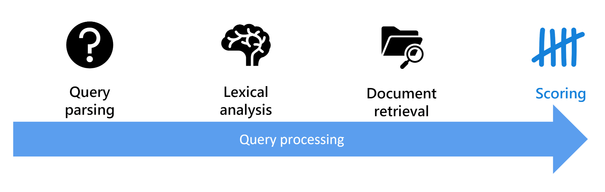

#### Replicas and partitions
- Depending on the pricing tier you select, you can optimize your solution for scalability and availability by creating replicas and partitions.
  - Replicas are instances of the search service - you can think of them as nodes in a cluster. Increasing the number of replicas can help ensure there is sufficient capacity to service multiple concurrent query requests while managing ongoing indexing operations.
  - Partitions are used to divide an index into multiple storage locations, enabling you to split I/O operations such as querying or rebuilding an index.

  #### Search components
     - Data source
     - Skillset (Enrich data with AI)
     - Indexer (Engine does indexing)
     - Index (serchble unit)

- The indexing process works by creating a document for each indexed entity. During indexing, an [enrichment pipeline](https://learn.microsoft.com/en-us/training/modules/create-azure-cognitive-search-solution/4-indexing-process) iteratively builds the documents that combine metadata from the data source with enriched fields extracted by cognitive skills. 

  #### Azure AI Search Parameters
- search - A search expression that includes the terms to be found.
- queryType - The Lucene syntax to be evaluated (simple or full).
- searchFields - The index fields to be searched.
- select - The fields to be included in the results.
- searchMode - Criteria for including results based on multiple search terms

  #### Search Query Processing Stages:
- Query parsing - evaluated and reconstructed as a tree of appropriate subqueries. 
- Lexical analysis - The query terms are analyzed and refined based on linguistic rules. 
- Document retrieval - Matched against the indexed terms, and matching documents are identified.
- Scoring - A relevance score is assigned 

Summary
-------
A data source where the data to be indexed is stored (though you can also push data directly into an index by using the API).
A skillset that defines and enrichment pipeline of cognitive skills to enrich the index data.
An index that defines fields, which the user can query.
An indexer that populates the fields in the index with values extracted from the source data.

## Implement custom skills

### Implement a custom skill for Azure AI Search
  - Define Input & Output schema JSON
### Integrate a custom skill into an Azure AI Search skillset
  - Update [skills array](https://learn.microsoft.com/en-us/training/modules/create-azure-ai-custom-skill/3-add-custom-skill)
### Enrich a search index using a custom text classification model
- Use Language service with [custom text classification skill](https://learn.microsoft.com/en-us/training/modules/create-azure-ai-custom-skill/4-custom-text-classification-skill) using  Language Studio
### Enrich a search index with an Azure Machine Learning custom skill
- Include Azure Machine Learning (AML) [AmlSkill to AML model](https://learn.microsoft.com/en-us/training/modules/create-azure-ai-custom-skill/5-ml-custom-skill) using Machine Learning studio

Example custom skill - [tabulates the frequency of individual words in a document to generate a list of the top five most used words](https://microsoftlearning.github.io/mslearn-knowledge-mining/Instructions/Exercises/02-search-skills.html), and add it to a search solution for Margie’s Travel 

---

## Knowledge stores

- While the index might be considered the primary output from an indexing process, the enriched data it contains might also be useful in other ways.
- [The knowledge store consists of projections of the enriched data](https://learn.microsoft.com/en-us/training/modules/create-knowledge-store-azure-cognitive-search/1-introduction), which can be JSON objects, tables, or image files. 
- When an indexer runs the pipeline to create or update an index, the projections are generated and persisted in the knowledge store.

### Why a Knowladge Store?

- Persist the output from an Azure AI Search enrichment pipeline for independent analysis or downstream processing.
  - Azure Data Factory
  - Microsoft Power BI
  - To save extracted images (during indexing process) as files  
- This Downstreaming is done by Projections
- [`Azure AI Search REST interface`](https://microsoftlearning.github.io/mslearn-knowledge-mining/Instructions/Exercises/03-knowledge-store.html)

### Define Projection
- The [projections of data](https://learn.microsoft.com/en-us/training/modules/create-knowledge-store-azure-cognitive-search/2-define-projection-json) to be stored in your knowledge store are based on the document structures generated by the enrichment pipeline in your indexing process.
- Shaper skill to create a new, field containing a simpler structure for the fields you want to map to projections.

- you must define a separate projection for each type of projection, such as tables, objects, and files.
  - Object projections are JSON representations of the indexed documents.
  - File projections are JPEG files containing image data extracted from documents.
  - Table projections create a relational schema for the extracted data.

----
## Advanced Search Features in Azure AI Search



### Term Boosting
### Improve the relevance of results by adding scoring profiles
### Analyzers in AI Search
- Language analyzers
- Specialized analyzers
- [custom analyzer](https://learn.microsoft.com/en-us/training/modules/implement-advanced-search-features-azure-cognitive-search/04-improve-index-analyzers-tokenized-terms)
  - Character filters
  - Tokenizers
  - Token filters

----

## Azure AI Search using Azure Data Factory
### Use Azure Data Factory to copy data into an Azure AI Search Index
### Use the Azure AI Search push API to add to an index from any external data source

---

## Maintain an Azure AI Search solution
### Use Language Studio to enrich Azure AI Search indexes
### Enrich an AI Search index with custom classes

---

## Perform search reranking with semantic ranking in Azure AI Search
### Describe semantic ranking
### Set up semantic ranking
### Perform semantic ranking on an index

---

## Perform vector search and retrieval in Azure AI Search
### Describe vector search
### Describe embeddings
### Run vector search queries using the REST API


---

# Question Summary

## A Search Index

- In Azure AI Search, index is your searchable content (document). Conceptually, a document is a single unit of searchable data in your index.
- Suppose if search engine looks up "indexes" in a database...
  - a search index equates to a table, and documents are roughly equivalent to rows in a table.

- The "fields" collection is typically the largest part of an index
  -  each field is named, assigned a data type, and attributed with allowable behaviors
  - structure of a document is determined by the index schema JSON
```
{
  "name": "name_of_index, unique across the service",
  "description" : "Health plan coverage for standard and premium plans for Northwind and Contoso employees."
  "fields": [
    {
      "name": "name_of_field",
      "type": "Edm.String | Collection(Edm.String) | Collection(Edm.Single) | Edm.Int32 | Edm.Int64 | Edm.Double | Edm.Boolean | Edm.DateTimeOffset | Edm.GeographyPoint",
      "searchable": true (default where applicable) | false (only Edm.String and Collection(Edm.String) fields can be searchable),
      "filterable": true (default) | false,
      "sortable": true (default where applicable) | false (Collection(Edm.String) fields cannot be sortable),
      "facetable": true (default where applicable) | false (Edm.GeographyPoint fields cannot be facetable),
      "key": true | false (default, only Edm.String fields can be keys),
      "retrievable": true (default) | false,
      "analyzer": "name_of_analyzer_for_search_and_indexing", (only if 'searchAnalyzer' and 'indexAnalyzer' are not set)
      "searchAnalyzer": "name_of_search_analyzer", (only if 'indexAnalyzer' is set and 'analyzer' is not set)
      "indexAnalyzer": "name_of_indexing_analyzer", (only if 'searchAnalyzer' is set and 'analyzer' is not set)
      "normalizer":  "name_of_normalizer", (applies to fields that are filterable)
      "synonymMaps": "name_of_synonym_map", (optional, only one synonym map per field is currently supported)
      "dimensions": "number of dimensions used by an embedding models", (applies to vector fields only, of type Collection(Edm.Single))
      "vectorSearchProfile": "name_of_vector_profile" (indexes can have many configurations, a field can use just one)
    }
  ],
  "suggesters": [ ],
  "scoringProfiles": [ ],
  "analyzers":(optional)[ ... ],
  "charFilters":(optional)[ ... ],
  "tokenizers":(optional)[ ... ],
  "tokenFilters":(optional)[ ... ],
  "defaultScoringProfile": (optional) "...",
  "corsOptions": (optional) { },
  "encryptionKey":(optional){ },
  "semantic":(optional){ },
  "vectorSearch":(optional){ }
}
```

## How to [Shape-up search results](https://learn.microsoft.com/en-us/azure/search/search-pagination-page-layout)

 - The shape of a response is determined by parameters in the query itself.
   - count - No of matches in index
   - "skip": 15 -  skipping the first 15
   - "top": 15 - returns the first set of 15 matching documents
   - "orderby": "id asc" - sort by document ID (must have sortable atribte)
   - "filter": "id ge 50" - (must have filterable atribte)
   - $filter=author eq 'selected-facet-value-here'