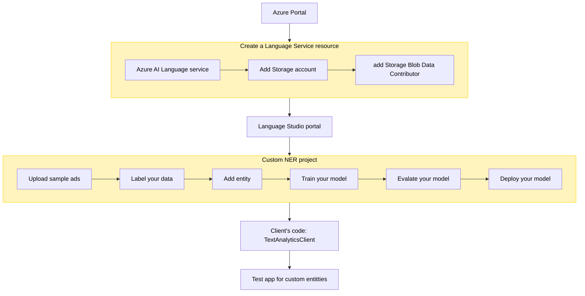
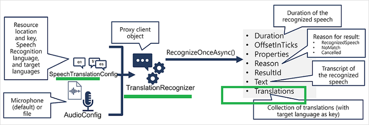

## Analyze text with Azure AI Language

<table border="1">
  <tr>
    <td rowspan="5">
    
    <td>1) Language detection - To determine which language is used in the input document.</td>
  </tr>
  <tr>
    <td>2) Key phrase extraction - Identify the main topics or core concepts</td>
  </tr>
  <tr>
    <td>3) Sentiment analysis - To determine how positive or negative the input text using  confidenceScores</td>
  </tr>
  <tr>
    <td>4) Named entity recognition - People, locations, time periods, organizations ..</td>
  </tr>
  <tr>
    <td>5) Entity linking - Providing reference links to Wikipedia articles</td>
  </tr>
</table>   

### Text Analysis App

#### Use Case:
- Travel agency wants to process hotel reviews that have been submitted to the company’s web site.  

#### Design: 
- Use Azure AI Language to determine the written language, the sentiment (positive, neutral, or negative), the main topics and named entities of each review.

---

## Create QnA Solusion with Azure AI Language Resource

### [Why Knowladge base is needed ?](https://microsoftlearning.github.io/mslearn-ai-language/Instructions/Exercises/02-qna.html)
   -  Azure AI Language includes a question answering capability
   -  Knowledge Base is needed for store QnA pairs 
   -  Azure AI Language Studio is used for Knowledge Base.

### Diff between QnA vs Conversational language understanding

<table border="1">
  <tr>
    <th>Question answering</th>
    <th>Language understanding</th>
  </tr>
  <tr>
    <td>User submits a question, expecting an answer</td>
    <td>User submits an utterance, expecting an appropriate action</td>
  </tr>
  <tr>
    <td>Service uses natural language understanding</td>
    <td>Service uses natural language understanding</td>
  </tr>
  <tr>
    <td>match the question to an answer in the knowledge base</td>
    <td>interpret the utterance, match it to an intent, and identify entities</td>
  </tr>
  <tr>
    <td>Response is a static answer to a known question</td>
    <td>Response indicates the most likely intent and referenced entities</td>
  </tr>
  <tr>
    <td>Client application typically presents the answer to the user</td>
    <td>Client application is responsible for performing appropriate action based on the detected intent</td>
  </tr>
</table> 

### Qestion Answering App
#### Use Case:
- Many organizations publish FAQs as documents or web pages, which works well for a small set of question and answer pairs, but large documents can be difficult and time-consuming to search.

#### Design: 
- Use Azure AI Language's question answering capability that enables you to create a knowledge base of question and answer pairs.
- Most commonly company used as a Chat bot that can look up answers to questions.

---

## Build a Conversational Language Understanding Model

### A common design pattern for CLU

<table border="1">
  <tr>
    <td rowspan="3">
    
    <td>1) An app accepts natural language input from a user.</td>
  </tr>
  <tr>
    <td>2) A language model is used to determine semantic meaning (the user's intent).</td>
  </tr>
  <tr>
    <td>3) The app performs an appropriate action.</td>
  </tr>
</table>

### [CLU Capabilities](https://learn.microsoft.com/en-us/training/modules/build-language-understanding-model/2a-understand-prebuilt-capabilities)

```mermaid
flowchart LR
   A[CLU Capabilities]:::box

   X0[Pre-configured<br>features]:::box
   Y0["• Summarization<br>(PII) detection"]:::box
   Y1["• Key phrase extraction<br>• Sentiment analysis<br>• Language detection <br>• Named entity recognition<br>• Question answering"]:::box

    
   X1[Learned features]:::box
   Z0["• CLU<br>• Custom named entity recognition<br>• Custom text classification"]:::box
   
   X3["How to Define<br> the Model"]:::green-step
   O1[Utterances]:::green-step
   O2[Intents]:::green-step
   O3[Entities]:::green-step

   %% Built-In Tools
   A ==> X0 ==> Y0 
          X0 ==> Y1

   %% Custom Tools
   A ==> X1 
   X1 ==> Z0

   %% other
   A ==> X3
   X3 --> |user input|O1 -.-> B["💡 user entered text / voice"]:::my
   X3 --> |get meaning|O2 -.-> C["💡 task or action to perform"]:::my
   X3 --> |undertand subjects|O3 -.-> D["💡 1 or more device list to apply task"]:::my



   %% invisible node
    classDef my stroke-width:0,fill:none
    classDef box fill:#ECECFF,color:black
    classDef green-step fill:#9bf4b2,color:black,stroke:#9bf4b2
```

### Conversational Language Understanding App
#### Use Case:
- a conversational language model for a clock application might be expected to process input such as:
   - What is the time in London?
   - Tell me time in London?
   - What is UK time now?
- *NOTE - CLU can be used to identify user wants to know time in London. But client application must implement to determine the correct time and show user.*

#### Design: 
 - define a conversational language understanding model that applications can use to interpret natural language input from users, predict the users intent (what they want to achieve), and identify any entities to which the intent should be applied.

---

## Create a custom text classification App

- Learn how to use the Azure AI Language service to classify text into custom groups.
 
### Use Case:
- A video game summary might be classified as "Adventure", "Strategy", "Action" or "Sports".
- [Developer defines, to text files](https://learn.microsoft.com/en-us/training/modules/custom-text-classification/2-understand-types-of-classification-projects)
### Design
- Custom text classification projects are all about [build, train, improve, and deploy your classification model](https://learn.microsoft.com/en-us/training/modules/custom-text-classification/3-understand-how-to-build-projects). 
- our labels would be "Action", "Adventure", "Strategy", and so on.
- Training will teach our model what types of video game summaries should be labeled which genre.

```mermaid 
flowchart TD

   subgraph Horizontal1[Create&nbsp;a&nbsp;Language&nbsp;Service&nbsp;resource]
      direction LR
      X0[Azure AI Language service]:::box
      X1[Add Storage account]:::box
      X2[Agree on Responsible AI Notice]:::box
      X3[Get Keys and Endpoint]:::box 
      
      X0 --> X1 --> X2 --> X3
   end

   %% main tree
   Horizontal1 ==> A[Define Lables]
   A ==> B[Tag Data] ==> C[Train Model]
   C ==> D[View Model] ==> |Identify weak labels|E[Improve Model] ==> F[Deploy Model]
    ==> H[Classify Text]:::green-step ==> G["💡"]:::my
   A -.-> |identify categories|info1["• Action<br>• Adventure<br>• Strategy<br>• Sports"]
   B  -.-> |label existing game summaries|info2["• Explore a lost world → Adventure<br>•  A cricket → Sport"]
   C  -.-> info3["Upload labeled data to Azure AI Language Studio"]
   D  -.-> |evaluate Model|info4["Check precision, recall, and F1-score"]
   E  -.-> |fix mislabled data|info5["Strategy mislabeled with Adventure"]
   F  -.-> |GameGenreClassifier|info6["Deployed trained model as an API endpoint"]
   H  -.-> |call the API|info7["API returns predicted label"]

   %% style definition
   classDef infoNode stroke-dasharray:5,stroke:#888
   classDef box fill:#ECECFF,color:black
   classDef green-step fill:#9bf4b2,color:black,stroke:#9bf4b2

   style Horizontal1 fill:#FFF4BD,color:black,stroke:#FFD700,stroke-width:1px
   
   %% Apply the class to multiple nodes
   class info1,info2,info3,info4,info5,info6,info7 infoNode
   class A,B,C,D,E,F box
   
   classDef my stroke-width:0,fill:none
```

 

### Azure AI Languge [Evaluation metrics](https://learn.microsoft.com/en-us/training/modules/custom-text-classification/2-understand-types-of-classification-projects)
   * Model evaluation is triggered automatically after training  custom text classification.
   * [Correct classification] - Suppose actual label is x and the model predicts a label x.
   * For evaluation, custom text classification uses the [following metrics](https://learn.microsoft.com/en-us/azure/ai-services/language-service/custom-text-classification/concepts/evaluation-metrics?azure-portal=true)
      - *Precision -*  reveals how many of the predicted classes are correctly labeled
      - *Recall -* reveals how many of the predicted classes are correct.
      - *F1 Score -* is a function of precision and recall., seek seek a balance between precision and recall.
#### Example Evaluation
   - let's your model is correctly classifying "Action" games and some "Action and Strategy" games, but failing at "Strategy" games. 
   - To improve your model, you'll want to find more high quality and varied summaries for both "Action and Strategy" games, as well as "Strategy" games to teach your model how to differentiate the two.

---
### 4.5] Custom named entity recognition

   - [Why custom NER?](https://microsoftlearning.github.io/mslearn-ai-language/Instructions/Exercises/05-extract-custom-entities.html) 
     -  When the entities you want to extract are not included in the built-in services
     - Knowladge Miniing and improve search results
   - Defined your custom entity clearly

### 4.6] Translate text with Azure AI Translator service

### 4.7] Create speech-enabled apps with Azure AI services

### Azure Speech Recognition [Speech-to-text API](https://learn.microsoft.com/en-us/training/modules/create-speech-enabled-apps/3-speech-to-text)

### Azure Speech Synthesis [text-to-speech API](https://learn.microsoft.com/en-us/training/modules/create-speech-enabled-apps/4-text-to-speech)

### 4.8] Translate speech with the Azure AI Speech service

#### Specify translation options
- Word alignment
- Sentence length
- Profanity filtering
[TODO] https://learn.microsoft.com/en-us/training/modules/translate-text-with-translator-service/6-exercise-translate-text

### [Speech translation](https://learn.microsoft.com/en-us/training/modules/translate-speech-speech-service/3-translate-speech-text) using the Azure AI Speech SDK

[TODO] Speech Translation APP: https://microsoftlearning.github.io/mslearn-ai-language/Instructions/Exercises/08-translate-speech.html

### 4.9] Develop an audio-enabled generative AI application

[TODO]