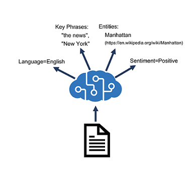
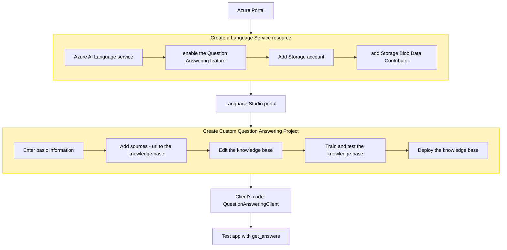
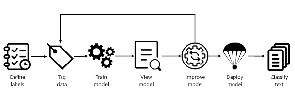
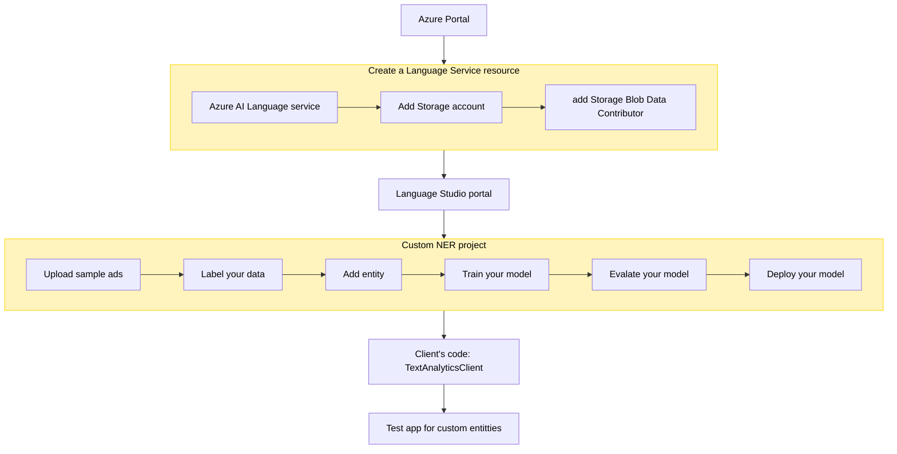

# 4] Azure AI Language Studio (To create your NLP App)
### 4.1] Azure AI Language Service:
   * Language detection
   * Key phrase extraction - text that indicate the main topics or core concepts
   * Sentiment analysis - how positive or negative the text is
   * Named entity recognition - people, locations, time periods, organizations ..
   * Entity linking - providing reference links to Wikipedia articles



### 4.2] Create QnA Solusion with Azure AI Language Resource

   [Why Knowladge base is needed ?](https://microsoftlearning.github.io/mslearn-ai-language/Instructions/Exercises/02-qna.html)
         ```
         Azure AI Language includes a question answering capability that enables you to create a knowledge base of question and answer pairs that can be queried using natural language input.
         Create a question answering project in Azure AI Language Studio.
         ```

### 4.3] Build a Conversational Language Understanding Model
### Pre-configured features of Azure AI Language service :  features without any model labeling or training
   * Language detection
   * Key phrase extractions
   * Sentiment analysis 
   * Named entity recognition
   * Entity linking
   * Summarization
### Learned features of Azure AI Language service :  require you to label data, train, and deploy your model
   [Why CLU is needed ?](https://microsoftlearning.github.io/mslearn-ai-language/Instructions/Exercises/03-language-understanding.html)
      ```
      CLU - To interpret natural language input from users, predict the users intent (what they want to achieve), and identify any entities to which the intent should be applied.
      Create a conversational language understanding project in Azure AI Language Studio.
      ```
   * Conversational language understanding (CLU)
   * Question answering
   * Custom named entity recognition
   * Custom text classification
### 4.4] Create a custom text classification solution
### Azure AI Language project life cycle
   
   ```
   Create a custom text classification project in Azure AI Language Studio.
   ```
   * When labeling multiple label projects, you can assign as many classes that you want per file
   

#### Azure AI Languge [Evaluation metrics](https://learn.microsoft.com/en-us/azure/ai-services/language-service/custom-text-classification/concepts/evaluation-metrics?azure-portal=true)
   * Model evaluation is triggered automatically after training  custom text classification.
      * Recall - How many true-positives lables were identified
      `Recall = #True_Positive / (#True_Positive + #False_Negatives)`
      * Precision - How many of the predicted labels are correct
      `Precision = #True_Positive / (#True_Positive + #False_Positive)`
      * F1 Score - A function of recall and precision, seek seek a balance between precision and recall.
      `F1 Score = 2 * Precision * Recall / (Precision + Recall)`
### 4.5] Custom named entity recognition

   - [Why custom NER?](https://microsoftlearning.github.io/mslearn-ai-language/Instructions/Exercises/05-extract-custom-entities.html) 
     -  When the entities you want to extract are not included in the built-in services
     - Knowladge Miniing and improve search results
   - Defined your custom entity clearly





### 4.6] Translate text with Azure AI Translator service

### 4.7] Create speech-enabled apps with Azure AI services

### Azure Speech Recognition [Speech-to-text API](https://learn.microsoft.com/en-us/training/modules/create-speech-enabled-apps/3-speech-to-text)


### Azure Speech Synthesis [text-to-speech API](https://learn.microsoft.com/en-us/training/modules/create-speech-enabled-apps/4-text-to-speech)


### 4.8] Translate speech with the Azure AI Speech service

### [Speech translation](https://learn.microsoft.com/en-us/training/modules/translate-speech-speech-service/3-translate-speech-text) using the Azure AI Speech SDK


### 4.9] Develop an audio-enabled generative AI application