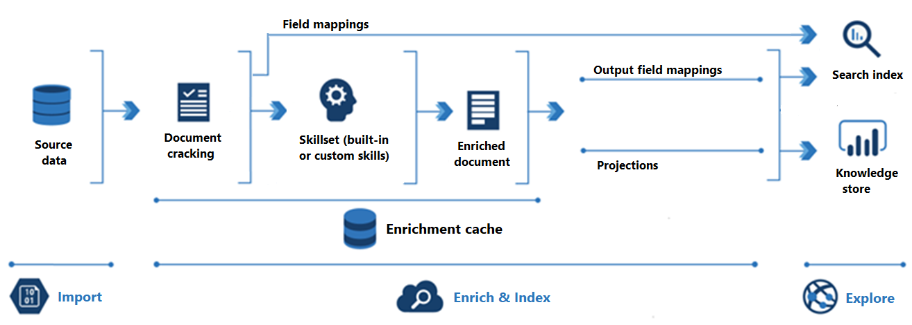
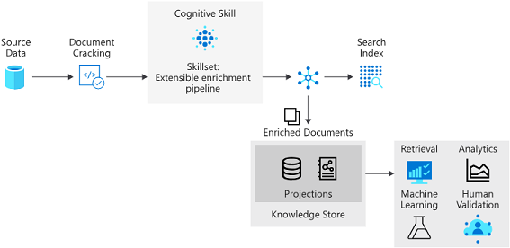

## Indexing

## [Indexing Process](https://learn.microsoft.com/en-us/azure/search/search-indexer-overview)

- [1] Document cracking
    - Opening files & extract content
- [2] Field mappings
    -  indexer extracts text from a source field and sends it to a destination field in an index or knowledge store.
- [3] Skillset execution
    - skillset execution is where enrichment occurs
    - Skillsets can add OCR, Image Analysis or NLP
    - Actually,  These Cognitive Skills are to extract AI-generated fields from documents and include them in a search index.
- [4] Output field mappings
    -  enriched document formed as a tree structure
    - define which part of the tree map into which feild into your index

## [Custom skills](https://learn.microsoft.com/en-us/azure/search/cognitive-search-predefined-skills)

    ### Context
    - During the Indexing Process, we know that Built-In AI Cognitive Skills are used for skillset executing at the step [3].
    - It is good to know that we can inject our own deployed cutom skill that is deployed in Web. 

- Microsoft.Skills.Custom.WebApiSkill - Inject using HTTP call into a [custom Web API](https://learn.microsoft.com/en-us/training/modules/create-azure-ai-custom-skill/4-custom-text-classification-skill)
- Microsoft.Skills.Custom.AmlSkill - Inject an an [Azure Machine Learning model](https://learn.microsoft.com/en-us/training/modules/create-azure-ai-custom-skill/5-ml-custom-skill)

[TODO]: Implement custom skills
---

## What is a [Knowladge Store?](https://learn.microsoft.com/en-us/azure/search/knowledge-store-concept-intro?tabs=portal)

- Other than Index, the Knowladge Store is the Secondary output of Indexing Process.
- A knowledge store is used for downstream processing like knowledge mining.
    - Azure Data Factory
    - Microsoft Power BI
    - To save extracted images
- This Downstreaming is done by Projections
- Type of Projections
    - Object projections : To store JSON formatted output
    - File projections : To store Tablur image output
    - Table projections : To store Tablur formatted output

[TODO] - Create knowladge mining solusion: https://learn.microsoft.com/en-us/training/modules/create-knowledge-store-azure-cognitive-search/4-exercise-knowledge-store

