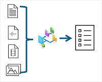

## Azure AI Content Understanding 
- Azure AI Content Understanding is use to extract insights and data from multiple kinds of content. 
- This is NOT NLP's CLU - Conversational Language Understanding

- [TODO] Develop a [Content Understanding](https://microsoftlearning.github.io/mslearn-ai-information-extraction/Instructions/Labs/01-content-understanding.html) backend and [client application](https://learn.microsoft.com/en-us/training/modules/analyze-content-ai-api/05-exercise)

---

## Create Azure AI Search Service
### Replicas and partitions
- These are helpful to optimize your solution on scalability and availability

- Replicas : nodes in a cluster
  - Increasing the number of replicas can handle multiple concurrent query requests while managing ongoing indexing operations.
  - Partitions are used to divide an index into multiple storage locations, enabling you to split I/O operations such as querying or rebuilding an index.
### Search Service Components
- Data source
- Skillset (Enrich data with AI)
- Indexer (Engine does indexing)
- Index (searchble unit) : It has following "Feild" attributes
  - key: unique key for index records.
  - searchable: if index can be queried using full-text search.
  - filterable: if index can be included in filter expressions to filter results.
  - sortable: if index can be used to order the results.
  - facetable: to determine values for facets 
  - retrievable: to included in search results 

### Search an index
- After you have created and populated an index, you can query it to search for information in the indexed document content.

#### Search Query Processing Stages:
- Query parsing - evaluated and reconstructed as a tree of appropriate subqueries. 
- Lexical analysis - The query terms are analyzed and refined based on linguistic rules. 
- Document retrieval - Matched against the indexed terms, and matching documents are identified.
- Scoring - A relevance score is assigned 
- [Apply filtering and sorting](https://learn.microsoft.com/en-us/training/modules/create-azure-cognitive-search-solution/6-apply-filtering-sorting): $filter, $orderby 

#### Custom scoring and result boosting
- Define a scoring profile, you can specify its use in an individual search, or you can modify an index definition so that it uses your custom scoring profile by default.

#### Synonyms
- To be accurate, the UK and Great Britain are different entities - but they're commonly confused with one another; so it's reasonable to assume that someone searching for "United Kingdom" might be interested in results that reference "Great Britain".
---
## Indexing

- The indexing process works by creating a document for each indexed entity. During indexing, an [enrichment pipeline](https://learn.microsoft.com/en-us/training/modules/create-azure-cognitive-search-solution/4-indexing-process) iteratively builds the documents that combine metadata from the data source with enriched fields extracted by cognitive skills. 

## [Indexing Process](https://learn.microsoft.com/en-us/azure/search/search-indexer-overview)

- [1] Document cracking
    - Opening files & extract content
- [2] Field mappings
    -  indexer extracts text from a source field and sends it to a destination field in an index or knowledge store.
- [3] Skillset execution
    - skillset execution is where enrichment occurs
    - Skillsets can add OCR, Image Analysis or NLP
    - Actually,  These Cognitive Skills are to extract AI-generated fields from documents and include them in a search index.
- [4] Output field mappings
    -  enriched document formed as a tree structure
    - define which part of the tree map into which feild into your index

## [Custom skills](https://learn.microsoft.com/en-us/azure/search/cognitive-search-predefined-skills)

    ### Context
    - During the Indexing Process, we know that Built-In AI Cognitive Skills are used for skillset executing at the step [3].
    - It is good to know that we can inject our own deployed cutom skill that is deployed in Web. 

- Microsoft.Skills.Custom.WebApiSkill - Inject using HTTP call into a [custom Web API](https://learn.microsoft.com/en-us/training/modules/create-azure-ai-custom-skill/4-custom-text-classification-skill)
- Microsoft.Skills.Custom.AmlSkill - Inject an an [Azure Machine Learning model](https://learn.microsoft.com/en-us/training/modules/create-azure-ai-custom-skill/5-ml-custom-skill)

[TODO]: Implement custom skills
---

## What is a [Knowladge Store?](https://learn.microsoft.com/en-us/azure/search/knowledge-store-concept-intro?tabs=portal)

- Other than Index, the Knowladge Store is the Secondary output of Indexing Process.
- A knowledge store is used for downstream processing like knowledge mining.
    - Azure Data Factory
    - Microsoft Power BI
    - To save extracted images
- This Downstreaming is done by Projections
- Type of Projections
    - Object projections : To store JSON formatted output
    - File projections : To store Tablur image output
    - Table projections : To store Tablur formatted output

[TODO] - Create knowladge mining solusion: https://learn.microsoft.com/en-us/training/modules/create-knowledge-store-azure-cognitive-search/4-exercise-knowledge-store

---
## Advanced Search Features in Azure AI Search

### Term Boosting
### Improve the relevance of results by adding scoring profiles
### Analyzers in AI Search
- Language analyzers
- Specialized analyzers
- [custom analyzer](https://learn.microsoft.com/en-us/training/modules/implement-advanced-search-features-azure-cognitive-search/04-improve-index-analyzers-tokenized-terms)
  - Character filters
  - Tokenizers
  - Token filters
---
## Summary

- A data source where the data to be indexed is stored (though you can also push data directly into an index by using the API).
- A skillset that defines and enrichment pipeline of cognitive skills to enrich the index data.
- An index that defines fields, which the user can query.
- An indexer that populates the fields in the index with values extracted from the source data.

