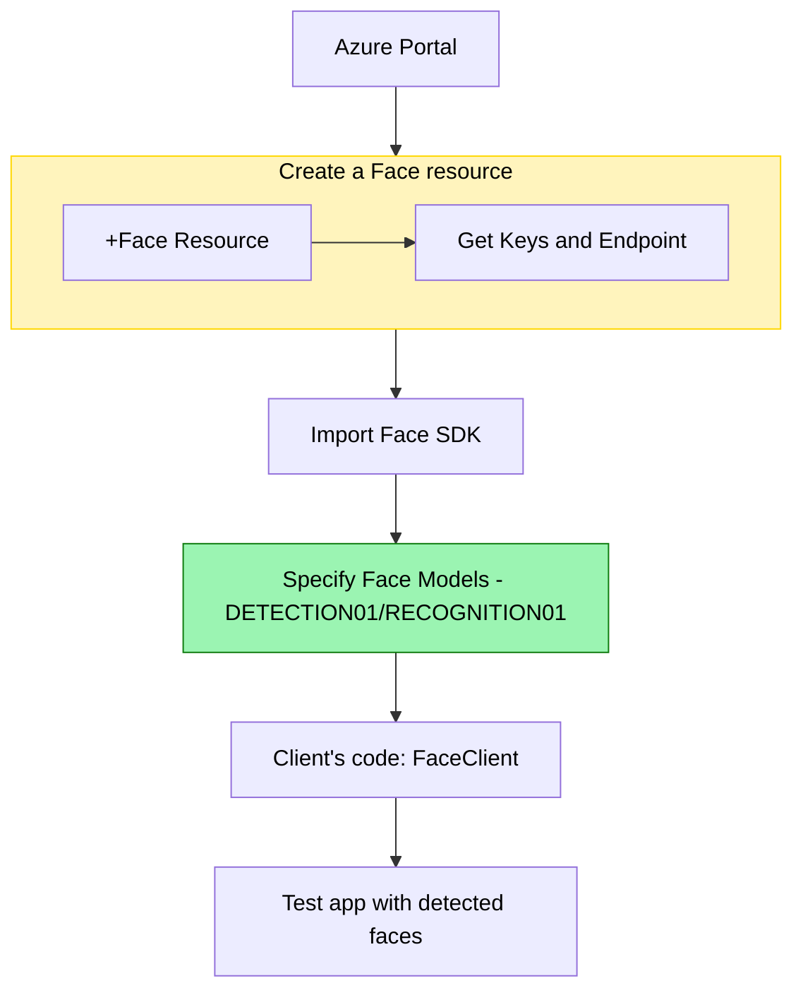

## Face Detect and analyze App

  - Use [Azure AI Vision service, and the Face service](https://microsoftlearning.github.io/mslearn-ai-vision/Instructions/Labs/03-face-service.html)

```mermaid
flowchart TD
   subgraph Horizontal1[Create&nbsp;a&nbsp;Face&nbsp;resource]
      direction LR
      X[+Face Resource]:::box --> Z[Get Keys and Endpoint]:::box
   end

   a[Azure Portal]:::box --> Horizontal1
   Horizontal1 --> A
   A[Import Face SDK]:::box
   B[Specify Face Models - DETECTION01/RECOGNITION01]:::green-step
   A --> B
   B -->  F[Client's code: FaceClient]:::box
   F --> K[Test app with detected faces]:::box

     %% Styling
    classDef box fill:#ECECFF,color:black
    classDef green-step fill:#9bf4b2,color:black,stroke:#107C10
    style Horizontal1 fill:#FFF4BD,color:black,stroke:#FFD700,stroke-width:1px

```