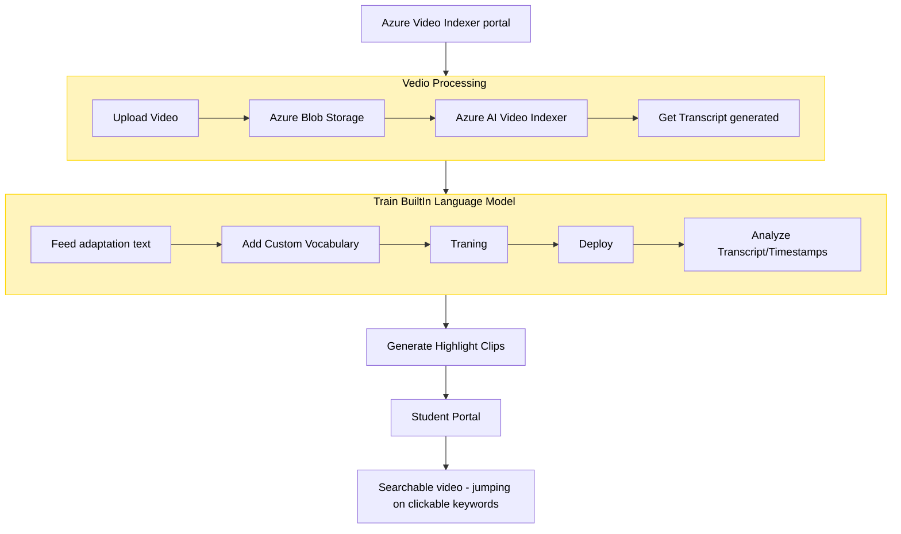
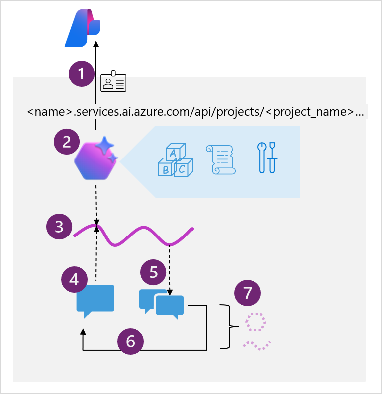

# Vedio Processing App

### Use Case:
- We have some missing lectures as video to complete before the examination of "Machine Learning 101". We only interested cover specific points  like "loss function" + "overfitting". 
- Need AI app to output Auto-generated video clips tagged with key moments of the lecture. 

### Design: 
- This demonstrate how to integrate  a [custom Language model with Azure Video Indexer](https://learn.microsoft.com/en-us/azure/azure-video-indexer/customize-language-model-how-to?tabs=customizewebportal)

---

# Run Language Model in Mobile App

### Use Case:

   - You are building an Azure AI Language solution.
     - You need to deploy the solution to a location without internet connectivity.
     - What should you do?

### Design: <TODO>
   - Use model in [Docker Image container](https://learn.microsoft.com/en-us/azure/ai-services/containers/disconnected-containers)
   - Consider [Billing & Data Security](https://learn.microsoft.com/en-us/training/modules/investigate-container-for-use-with-ai-services/3-use-ai-services-container)
   - Find difference between [Export Model](https://learn.microsoft.com/en-us/azure/ai-services/custom-vision-service/export-your-model) vs [Deploy to Containers](https://learn.microsoft.com/en-us/training/modules/investigate-container-for-use-with-ai-services/3-use-ai-services-container)

---

# Prompth Fow App
https://microsoftlearning.github.io/mslearn-ai-studio/Instructions/03-Use-prompt-flow-chat.html

---

#  Agent Project Idea for Gaming
Simulated (NPC) Opponents:
    * Most AI opponents follow hardcoded behavior trees
    * Sim Agent analyze the player’s strategies and counter with enemies(NPC) in real time.
Storytelling Agent:
    * Most games use pre-written dialogues
    * Conversational story teller agent could have dynamic conversations with memory of player choices.

Game Master Agent:
    * Most survival games rely on predefined gaming story.
    * Game Master analyze player tactics and dynamically send aggressive enemies, limit resources, create random events.

AI Agents as “Living” Opponents & Allies (Beyond Standard NPC AI)
    * AI agents could use reinforcement learning (RL) to evolve.
    * Enemies and allies in your game LEARN over time, creating a more immersive experience.

#  Example Agentic App

    * 1- Connect to the AI Foundry project for your agent, using the project endpoint and Entra ID authentication.
    * 2- Get a reference to an existing agent
        * The model deployment that the agent interpret and respond to prompts.
        * Instructions that determine the functionality and behavior.
        * Tools and resources that the agent can use to perform tasks.
    * 3- Create a stateful thread that retains message history and data artifacts generated during the chat.
    * 4- Add messages to the thread and invoke it with the agent.
    * 5- Check the thread status, and when ready, retrieve the messages and data artifacts.
    * 6- Repeat the previous two steps as a chat loop until the conversation can be concluded.
    * 7- When finished, delete the agent and the thread to clean up.