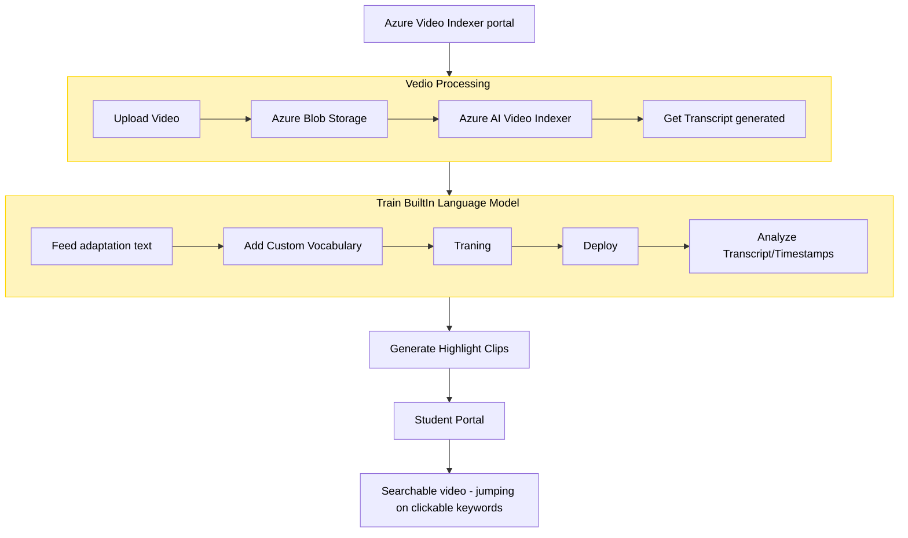

# Vedio Processing App

### Use Case:
- We have some missing lectures as video to complete before the examination of "Machine Learning 101". We only interested cover specific points  like "loss function" + "overfitting". 
- Need AI app to output Auto-generated video clips tagged with key moments of the lecture. 

### Design: 
- This demonstrate how to integrate  a [custom Language model with Azure Video Indexer](https://learn.microsoft.com/en-us/azure/azure-video-indexer/customize-language-model-how-to?tabs=customizewebportal)

---

